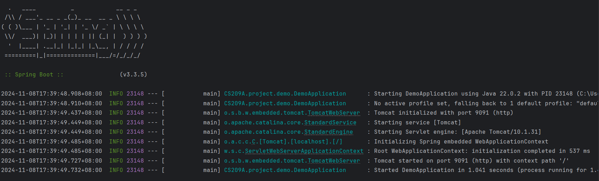
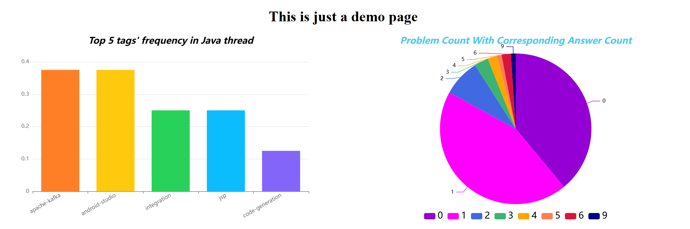

# CS209A Final Project Demo

This is a simple project demo, based on the SpringBoot web framework.

## Demo Introduction

The data used in the demo is fake, so it cannot be directly applied to your final project (although the sample charts may be modified and used).

This demo is a SpringBoot project with Maven as the package manager. The project uses SpringBoot version 3.3.5, and the default JDK version is 22. The frontend and backend of this demo are not separated (you can create a separate front-end and back-end project), and the frontend uses HTML, CSS, and Javascript (you can use Vue, React, or other front-end frameworks). The echarts framework for generating barchart and piechart is imported via CDN ([see the documentation for more details](https://echarts.apache.org/en/index.html)).

## How to Run the Demo

If you want to use this demo as the beginning of your final project, create a fork of this template - to avoid potential plagiarism disputes, **please be sure that your repository is made _private_ before the deadline**. But I recommend you start from **create a new project** (it will help you get more familiar with SpringBoot).

You need to then clone your repository into your local machine. You can then open the whole folder as a project in your IDE - it will recognize the SpringBoot Application structure and automatically configure the project.

Click button in DemoApplication.java file. If you see the result below, congratulations!

## How to See the Result

You can visit localhost:9091 or localhost:9091/demo (based on your port number) to see the demo result.

The demo is so simple, and we look forward to your creative ideas :)

## More Information

If there's anything ambiguous about the document or the instruction above, feel free to open an issue and ask. Your question may also help others to better understand this assignment.

